# AEG Power Balance Solver User Manual

I. D. Flintoft

Version 0.1, 16/08/2016

[TOC]

# Glossary

Acronym | Expansion
:-------|:----------------------------------------------
ACS     | Absorption cross-section
AE      | Absorption efficiency
CCDF    | Complementary cumulative distribution function
CCS     | Coupling cross-section
CDF     | Cumulative distribution function
CE      | Coupling efficiency
EMT     | Electromagnetic topology
GO      | Geometric optics
JIT     | Just-in-time
PDF     | Probability density function
PoA     | Point of absorption
PoC     | Point of coupling
PoE     | Point of entry/exit
PWB     | Power balance
SC      | Short circuited
SCS     | Scattering cross-section
SE      | Scattering efficiency
TCS     | Transmission cross-section
TE      | Transmission efficiency

# The modelling work-flow

## General concepts

The functions forming the power balance (PWB) solver all have the prefix `pwbs`.

Tags used for naming objects must be valid variables names, .i.e they must begin 
with a letter and contain only letters, numbers and underscore characters. 
Letter can be upper or lower case and the tag in case-sensitive.

The representation of the different objects in the PWB model and their 
associated coupling cross-sections (CCSs) are given in the table below:

object type | circuit |  EMT   | CCS | associated source
:-----------|:-------:|:------:|:---:|:-----------------
cavity      | node    | volume | ACS | no
aperture    | edge    | PoE    | TCS | yes
absorber    | edge    | PoA    | ACS | no
antenna     | edge    | PoA    | ACS | yes
source      | edge    | -      | -   | n/a
scatterer   | virtual | -      | SCS | no

The circuit representation of the key variables are:

variable      | circuit representation
:-------------|:----------------------------
power         | through variable ("current")
power density | across variable ("voltage")
CCS           | admittance

There are separate name-spaces for cavity, aperture, absorber, antenna and 
source objects; however, it is recommended to use distinct names for all 
objects. Name tags used as references by other objects must be defined at the 
point at which they are used. Virtual objects, such as scatterers are not 
represented directly in the circuit model; their effect is internal to other 
objects.

The model can be in one of three states:

   1. 'init'   - The model is initialised and objects may been added to the model.
   2. 'setup'  - Dependencies between the objects have been set up.
   3. 'solved' - The solution has been calculated.

Once a model is set up further objects cannot be added.

The various model outputs become available with progress through the different 
states. The state in which an output is available is noted below for the outputs 
of each object types below.

## ASCII input data files

Many of the objects are able to read input parameters from external ASCII files. 
For general format supported for these files is

The ASCII files have the format:
    
    # Optional header lines using hash comment character
    #
    # Followed by two or more equal length colums of numeric
    # data using spaces to delimit the columns.
     f(1)      p(1,1)  ... p(1,m)
     f(2)      p(2,1)  ... p(2,m)
     f(3)      p(3,1)  ... p(3,m)
     ....      ......  ... ......    
     f(n)      p(n,1)  ... p(n,m)
     
The first column is interpreted as the frequency vector in hertz. The frequency
range should span the frequency range of the model, with the highest and lowest 
model lying on or between ``f(1)` and `f(n)`. The remaining columns are interpreted
as `m` frequency dependent data vectors with units and ranges appropriate to the
context. For examples, CCSs and CEs must be positive numbers. The data vectors are
interpolated onto the frequencies used by the particular model. An extra colums
in the ASCII file not required for the specific context will be ignored.

## Model initialisation

A PWB model is initialised using the function call

    [ pwbm ] = pwbsInitModel( f , modelName )

where the arguments and outputs are:

argument/return | type              | unit | description
:---------------|:-----------------:|:----:|:-------------------
`f`             | double vector [1] | Hz   | list of frequencies
`modelName`     | string            | -    | name of model
`pwbm`          | structure         | -    | model state 

[1] Must be either a scalar or a column vector. The length of the vector, i.e. 
the number of frequencies, is denoted by `numFreq` in the following. All 
frequency dependent outputs have this number of rows.

## Saving and loading models

To save a PWB model to a file use the function call

    pwbsSaveModel( pwbm )

This will save the model state to a file called `modelName.mat` where 
`modelName` is the name of the model. To load a model from a file use
    
    [ pwbm ] = pwbsLoadModel( modelName )
    
The input arguments and output values are:

argument/return | type      | unit | description
:---------------|:---------:|:----:|:-------------
`modelName`     | string    | -    | name of model
`pwbm`          | structure | -    | model state 

## Viewing the model's EMT

The electromagnetic topology (EMT) of the model can be viewed using the function call

    pwbsDrawEMT( pwbm )

A typical EMT is shown in the figure below:

The elements of the PWB model are represented by:

object                   | representation
:------------------------|:--------------------------------------------------------------------------
reference node           | small green circle without a label
cavity                   | aqua circle with cavity name inside 
cavity with scatterer(s) | aqua circle with cavity name inside inside another circle
external environment     | coral circle with label 'EXT' inside
absorber/antenna         | named edge with filled arrow in direction of power absorption
aperture                 | named edge with unfilled arrow in direction of net power flow
source (power )          | named edge with filled arrow and circle in direction of source power
source (power density)   | named edge with unfilled arrow and circle in direction of power absorption

The reference node is the ultimate source/sink of all power in the model.

## Setting up the model

Before the model can be solved various linkages have to be made between the 
objects in the model. This set up process is carried out by calling the function

    [ pwbm ] = pwbsSetupModel( pwbm )

with input arguments and output values:

argument/return | type      | unit | description
:---------------|:---------:|:----:|:-----------
`pwbm`          | structure | -    | model state 

## Solving the model

The model is solved by calling the function

    [ pwbm ] = pwbsSolveModel( pwbm )

with input arguments and output values:

argument/return | type      | unit | description
:---------------|:---------:|:----:|:-----------
`pwbm`          | structure | -    | model state 

## Compaction

 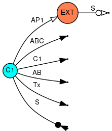

Part of an EMT can be "compacted", i.e. reduced to an equivalent single
object CCS. This allows stable models of parts of a large structure to be
modelled efficiently while other parts are under development. For example,
in the EMT on the left hand side above cavity `C2` and eveything connected 
to it can be replaced by a single absorber `ABC` as shown in the EMT on the 
right hand side. 

Compaction is achivied using the function call

    [ CCS ] = pwbsCompactModel( pwbm , objectType , objectTag , parameters )

with input arguments and output values:

argument/return | type          | unit | description
:---------------|:-------------:|:----:|:-----------------------------
`pwbm`          | structure     | -    | model state
`objectType`    | string        | -    | type of object
`objectTag`     | string        | -    | tag of object
`parameters`    | cell array    | -    | type specific parameter list
`CCS`           | double vector | m^2  | CCS of compacted EMT

The supported object types are
    
`objectType` | CCS | `parameters`
:------------|:---:|:----------------------------------------------
`Aperture`   | ACS | { apertureSide }

with parameters

parameter      | type           | unit | description
:--------------|:--------------:|:----:|:--------------------------------
`apertureSide` | integer scalar | -    | side of aperture (1 or 2)

The CCS of the compacted EMT is also written to an ASCII output file called
`modelName_objectType_objectTag_compacted.asc`.

### Compaction at an aperture

For `objectType` `Aperture` the compaction determines the total ACS looking 
through the aperture towards the cavity on side `apertureSide`. Any power 
sources in the compacted part of the EMT are open-circuited and, if present, the 
external power density source is short-circuited. In order for compaction to 
make sense and to work there **must not be another path through the compacted 
part of the EMT to the aperture at which the compaction is applied**. Currently 
it is the user's responsibility to ensure that this is the case.

## Post-processing

### Getting specific output data

Data can be retrieved from the model using the function

    [ data ] = pwbsGetOutput( pwbm , objectType , objectTag , outputs )

with input arguments and output values:
   
argument/return | type       | unit | description
:---------------|:----------:|:----:|:---------------------
`pwbm`          | structure  | -    | model state
`objectType`    | string     | -    | type of object
`objectTag`     | string     | -    | name of object
`outputs`       | cell array | -    | list of outputs
`data`          | cell array | -    | list of output values

Valid object types are `'Cavity'`, `'Absorber'`, `'Antenna'`, `'Aperture'` and 
`'Source'`. `outputs` must be a one-dimensional cell array of strings naming the 
required outputs:

    outputs = { 'output1' , 'output2' , .... , 'outputN' }
    
The output names depend on the object type and are given in the sections below. 
Some outputs are available immediately after an object is added while others are 
only available after the setup or solution phases. The valid outputs for a 
particular object type can also be determined and optionally listed using the 
function call

    [ validOutputs , units ] = pwbsValidOutputs( pwbm , objectType [ , isShow ] )

with input arguments and output values:
    
argument/return | type       | unit | description
:---------------|:----------:|:----:|:-------------------------------------
`pwbm`          | structure  | -    | model state
`objectType`    | string     | -    | type of object
`isShow`        | bool       | -    | whether to list outputs to screen [1]
`validOutputs`  | cell array | -    | list of valid output names
`units`         | cell array | -    | list of units for each output
    
[1] The default value is `true`.
    
### Exporting data to ASCII files

Data can be exported to an [ASCII][] file with the function

    pwbsExportOutput( pwbm , objectType , objectTag , outputs )

where the arguments are the same as for the `pwbsGetOutput` function. The data 
will be exported as a table in a flat ASCII file called 
`modelName_objectType_objectTag.asc`, where `modelName` is the name of the model 
`objectType` is the type of the object and `objectTag` is the object's name. All 
the outputs for all the objects can be exported using

    pwbsExportAll( pwbm )

The ASCII files have the format:
    
    # AEGPWB 0.1
    # objectType = Aperture [-]
    # tag = A1 [-]
    # type = Circular [-]
    # multiplicity =  1.00000e+00 [-]
    # area =  2.01062e-04 [m^2]
    # f_c =  5.44357e+09 [Hz]
    # isSource = 0.00000e+00 [-]
    ###
    #          f          TCS           TE
    #       [Hz]        [m^2]          [-] 
     1.00000e+09  5.72446e-08  1.13884e-03
     1.03019e+09  6.44764e-08  1.28272e-03 
     ...........  ...........  ...........
     1.12633e+09  9.21301e-08  1.83287e-03 
 
where the frequency independent outputs are written one per line in the format

    # output = value [units]
    
into the header of the file. After the triple comment character line `###` are 
two final comment lines containing a table header for the frequency dependent 
data. Finally there is a block of tabular data with `numFreq` rows giving the 
frequency dependent output values.

### Probability distributions 

The probability distributions of various quantities can be determined using the 
function

    [ x , y , meanQuantity , stdQuantity quantQuantity ] = ...
      pwbsProbDist( pwbm , objectType , objectTag , freq , quantity , dist )
    
where the input arguments and output values are:
    
argument/return | type          | unit | description
:---------------|:-------------:|:----:|:-----------------------------------------
`pwbm`          | structure     | -    | model state
`objectType`    | string        | -    | type of object
`objectTag`     | string        | -    | name of object
`freq`          | double scalar | Hz   | frequency at which to obtain distribution
`quantity`      | string        | -    | quantity to obtain distribution for
`dist`          | string        | -    | type of distribution
`x`             | double vector | [1]  | abscissa of distribution
`y`             | double vector | [1]  | ordinate of distribution
`meanQuantity`  | double scalar | [1]  | mean value of quantity
`stdQuantity`   | double scalar | [1]  | standard deviation of quantity
`quantQuantity` | double scalar | [1]  | quantiles of quantity

[1] Units depend on the quantity and distribution type requested.

The following disitrbution types are supported:

`dist` | description
:------|:----------------------------------------------
`CDF`  | Cumulative distribution function
`CCDF` | Complementary cumulative distribution function
`PDF`  | Probability density function

The abscissa ranges from the 1/1000-th to the 999/1000-th quantile for two-sided 
distributions and from zero to the 999/1000-th quantile for one-sided 
distributions. The possible values of `quantity` for each object type are given 
below

# Cavities

## Constructor

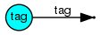

A cavity is added to a model using the function

    [ pwbm ] = pwbsAddCavity( pwbm , tag , type , parameters )

where the arguments and return values are:

argument/returns | type       | unit | description
:----------------|:----------:|:----:|:----------------------------
`pwbm`           | structure  | -    | model state 
`tag`            | string     | -    | cavity name
`type`           | string     | -    | type of cavity
`parameters`     | cell array | -    | type specific parameter list

The supported cavity types are

`type`             | `parameters`
:------------------|:----------------------------------
`'Cuboid'`         | `{ a , b , c , sigma , mu_r }`
`'Generic'`        | `{ area , volume , sigma , mu_r }`
`'GenericACS'`     | `{ area , volume , wallACS }`
`'GenericFileACS'` | `{ area , volume , fileName }`

with parameters

parameter   | type              | unit | range | description
:-----------|:-----------------:|:----:|:-----:|:-------------------------------
`a`         | double scalar     | m    | >0    | first side length
`b`         | double scalar     | m    | >0    | second side length
`c`         | double scalar     | m    | >0    | third side length
`area`      | double scalar     | m^2  | >0    | area of closed bounding surface
`volume`    | double scalar     | m^3  | >0    | volume
`sigma`     | double vector [1] | S/m  | >0    | wall conductivity
`mu_r`      | double vector [1] | -    | >=1   | wall relative permeability
`wallACS`   | double vector [1] | m^2  | >0    | ACS of cavity walls
`fileName`  | string            | -    | -     | file name for external ACS data

[1] Must be either a scalar or a `numFreq x 1` column vector. 

## Types

### `'Generic'` & `'Cuboid'`

For the `'Cuboid'` type the cavity surface `area` and `volume`, are determined 
from the cuboid side lengths (`a`,`b` & `c`), whereas for the `'Generic'` types 
the surface area and volume are given directly. The surface area is the nominal 
area of a *closed surface* including the area of the cavity walls and any 
apertures in them. The total area of any apertures added to the cavity 
(`apertureArea`) are subtracted from this nominal surface area to give the 
`wallArea` of the cavity during the setup phase.

For the `'Cuboid'` and `'Generic'` types the ACS of the cavity walls is 
determined from `wallArea` using the electrical parameters `sigma` and `mu_r`. 
For the types `'GenericACS'` and `'GenericFileACS'` the wall ACS is specified 
by the user either as a parameter or in an external file. This data would 
typically be determined from a measurement of the empty cavity, accounting for 
the losses in the measurement antennas used and any apertures in the cavity.

For the `'Generic'` types the number of modes (`numModes`) and mode density 
(`modeDensity`) in the cavity are determined from the Weyl formula with first 
order correction ([Liu1983][]). This formula is also used to estimate the 
frequency of the first and sixtieth modes, `f_1` and `f_60`. For the `'Cuboid'` 
type exact mode frequencies are calculated for the lowest 1000 modes and the 
number of modes and modeDEnsity is then smoothly matched onto the Weyl estimate 
for higher frequencies.

## Outputs

The supported cavity outputs in the different model states are

output                | state  | type              | unit  | description
:---------------------|:------:|:-----------------:|:-----:|:----------------------------------------------
`tag`                 | init   | string            | -     | name of cavity
`type`                | init   | string            | -     | type of cavity
`area`                | init   | double scalar     | m^2   | area of closed bounding surface
`volume`              | init   | double scalar     | m^3   | volume
`f_1`                 | init   | double scalar     | Hz    | frequency of first mode
`f_60`                | init   | double scalar     | Hz    | frequency of sixtieth mode
`numModes`            | init   | double vector [1] | -     | cumulative number of modes
`modeDensity`         | init   | double vector [1] | /Hz   | mode density 
`wallArea`            | setup  | double scalar     | m^2   | area of cavity walls
`apertureArea`        | setup  | double scalar     | m^2   | total area of all apertures in cavity
`wallACS`             | setup  | double vector [1] | m^2   | ACS of cavity walls
`wallAE`              | setup  | double vector [1] | -     | AE of cavity walls
`wallQ`               | setup  | double vector [1] | -     | partial quality factor of cavity walls
`wallDecayRate`       | setup  | double vector [1] | /s    | energy decay rate of cavity walls
`wallTimeConst`       | setup  | double vector [1] | s     | energy time constant of cavity walls
`modeBandwidth`       | solved | double vector [1] | Hz    | mode bandwidth 
`specificModeDensity` | solved | double vector [1] | -     | specific mode density
`f_Schroeder`         | solved | double scalar     | Hz    | Schroeder frequency of cavity
`powerDensity`        | solved | double vector [1] | W/m^2 | average scalar power density in cavity
`energyDensity`       | solved | double vector [1] | J/m^3 | average energy density in cavity
`wallPower`           | solved | double vector [1] | W     | average power absorbed in cavity walls
`totalACS`            | solved | double vector [1] | m^2   | total ACS of all absorbers in cavity
`totalTCS`            | solved | double vector [1] | m^2   | total TCS of all apertures in cavity
`totalQ`              | solved | double vector [1] | -     | total Q factor of cavity
`totalDecayRate`      | solved | double vector [1] | /s    | total energy decay rate of cavity
`totalTimeConst`      | solved | double vector [1] | s     | total energy time constant of cavity
`totalSourcePower`    | solved | double vector [1] | W     | total source power injected into cavity
`totalAbsorbedPower`  | solved | double vector [1] | W     | total power absorbed in cavity
`totalCoupledPower`   | solved | double vector [1] | W     | total power coupled out of cavity through apertures
`NindPaddle`          | solved | double vector [1] | -     | number of independent samples from scatterers
`NindFreq`            | solved | double vector [1] | /Hz   | number of independent samples per hertz

[1] These outputs are `numFreq x 1` column vectors. 

## Probability distributions

The supported quantities for output of probability distributions in cavities are:

quantity          | unit    | description
:-----------------|---------|:-----------------------------------------------
`'Eir'`           | V/m     | Real/imaginary part of electric field component
`'Ei'`            | V/m     | Magnitude of electric field component
`'Ei2'`           | V^2/m^2 | Squared magnitude of electric field component
`'E'`             | V/m     | Magnitude of total electric field
`'E2'`            | V^2/m^2 | Squared magnitude of total electric field
`'Hir'`           | A/m     | Real/imaginary part of magnetic field component
`'Hi'`            | A/m     | Magnitude of magnetic field component
`'Hi2'`           | A^2/m^2 | Squared magnitude of magnetic field component
`'H'`             | A/m     | Magnitude of total magnetic field
`'H2'`            | A^2/m^2 | Squared magnitude of total magnetic field
`'powerDensity'`  | W/m^2   | Scalar power density
`'energyDensity'` | J/m^3   | Energy density

# Apertures and lucent walls

## Constructor

An aperture is added to a model using the function

    [ pwbm ] = pwbsAddAperture( pwbm , tag , cavity1Tag , cavity2Tag ,  ...
      multiplicity , type , parameters )

where the arguments and return values are:

argument/return | type           | unit | description
:---------------|:--------------:|:----:|:-----------------------------------------
`pwbm`          | structure      | -    | model state 
`tag`           | string         | -    | aperture name
`cavity1Tag`    | string         | -    | name of cavity on first side of aperture
`cavity2Tag`    | string         | -    | name of cavity on second side of aperture
`multiplicity`  | integer scalar | -    | number of (identical) apertures to add
`type`          | string         | -    | type of aperture
`parameters`    | cell array     | -    | type specific parameter list

Positive net power is coupled from the first to second side of the aperture as 
defined by the order of the two cavity names. If the aperture couples into the 
external environment then `cavity2Tag` should be given as `'EXT'`.

The supported aperture types are:

`type`                | `parameters`
:---------------------|:---------------------------------------------
`'TCS'`               | `{ area , TCS }`
`'TE'`                | `{ area , TE  }`
`'FileTCS'`           | `{ area , fileName }`
`'FileTE'`            | `{ area , fileName }`
`'Generic'`           | `{ area , alpha_mxx , alpha_myy , alpha_ezz }`
`'Circular'`          | `{ radius }`
`'Elliptical'`        | `{ a_x , a_y }`
`'Square'`            | `{ side }`
`'Rectangular'`       | `{ side_x , side_y }`
`'LucentWall'`        | `{ area , thickness , eps_r , sigma , mu_r }`
`'LucentWallCCS'`     | `{ area , ACS1 , ACS2 , TCS }`
`'LucentWallCE'`      | `{ area , AE1 , AE2 , TE }`
`'LucentWallFileCCS'` | `{ area , fileName }`
`'LucentWallFileCE'`  | `{ area , fileName }`

with parameters

parameter     | type              | unit | range | description
:-------------|:-----------------:|:----:|:-----:|:----------------------------------------------
`area`        | double scalar     | m^2  | >0    | area of aperture
`TCS`         | double vector [1] | m^2  | >0    | average TCS of aperture
`TE`          | double vector [1] | -    | >0    | average TE of aperture
`fileName`    | string            | -    | -     | name of ASCII file containing CCS/CE data
`alpha_mxx`   | double scalar     | m^3  | >=0   | x-component of magnetic polarisability tensor
`alpha_myy`   | double scalar     | m^3  | >=0   | y-component of magnetic polarisability tensor
`alpha_ezz`   | double scalar     | m^3  | >=0   | z-component of electric polarisability tensor
`radius`      | double scalar     | m    | >0    | radius of circular aperture
`a_x`         | double scalar     | m    | >0    | semi-axis of elliptical aperture in x-direction
`a_y`         | double scalar     | m    | >0    | semi-axis of elliptical aperture in y-direction
`side`        | double scalar     | m    | >0    | side length of square aperture
`side_x`      | double scalar     | m    | >0    | side length of rectangular aperture in x-direction
`side_y`      | double scalar     | m    | >0    | side length of rectangular aperture in y-direction
`area`        | double scalar     | m^2  | >0    | area of aperture
`thicknesses` | double vector     | m    | >0    | thicknesses of layers
`epcs_r`      | complex array     | -    | -     | complex relative permittivity of layers
`sigma`       | double array      | S/m  | >0    | conductivity of layers
`mu_r`        | double array      | -    | >=1   | relative permeability of layers
`ACS1`/`ACS2` | double vector [1] | m^2  | >0    | average ACS side1/side2 of lossy aperture
`AE1`/`AE2`   | double vector [1] | -    | >0    | average AE side1/side2 of lossy aperture

[1] Must be either a scalar or an `numFreq` x 1 column vector.

## Types

### `'TCS'` &`'TE'`

For these types the TCS or TE is provided directly as a parameter. For a 
frequency dependent TCS/TE (indicated by the fact that `TCS`/`TE` is not a 
scalar) the cut-off frequency is estimated by fitting a high-pass response to 
the provided TCS/TE data.

### `'FileTCS'` & `'FileTE'`

For these types the TCS or TE is imported from an ASCII input file in the format 
described above. For a frequency dependent TCS/TE (more than one frequency in 
the file) the cut-off frequency is estimated by fitting a high-pass response to 
the provided TCS/TE data.

### `'Generic'`

A generic aperture is defined by its area, normal electric polarisability, 
`alpha_ezz` and tangential magnetic polarisabilitites `alpha_mxx` and `alpha_myy`.

### `'Circular'`

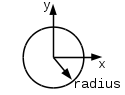

A circular aperture is defined by its `radius`.

### `'Elliptical'`

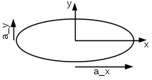

An elliptical aperture is defined by its semi-axes along the x- and 
y-directions, `a_x` and `a_y`.

### `'Square'`

A square aperture is defined by its `side` length.

### `'Rectangular'`

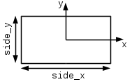

A rectangular aperture is defined by its side lengths along the x- and 
y-directions, `side_x` and `side_y`.

### `'LucentWall'`

A translucent wall between two cavities is a lossy aperture in which part of the 
incident power is absorbed in the wall and part is transmitted to the other 
side. With regard to the EMT a lucent wall contributes three edges:

 * An absorption in the first cavity (ACS1).
 * An absorption in the second cavity (ACS2).
 * A transmission between the two cavities (TCS)
 
This is shown in the EMT diagram below. The absorption on the first side is 
tagged with `tag_A1`, that on the second side with `tag_A2`, and the 
transmission by `tag_T`. The absorptions are implemented by adding separate 
absorber objects for each side. Implicitly this model assumes a GO limit 
approximation, i.e, the wall dimensions electrically large.

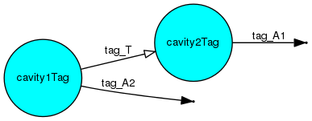

The basic `'LucentWall'` type is a laminated surface with `numLayer` layers as 
shown in the diagram below. `thicknesses` should be a `1 x numLayer` vector 
giving the thickness of each layer of the laminate starting at the `cavity1Tag` 
side. Each layer is defined by its electrical parameters. The material parameter 
arrays should be either `1 x numLayer` vectors for frequency independent 
parameters or `numFreq x numLayer` for frequency dependent parameters.

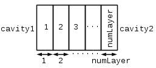

### `'LucentWallCCS'`, `'LucentWallCE'`, `'LucentWallFileCCS'` & `'LucentWallFileCE'`

The ACSs and TCS of a lucent wall can also be provided directly as parameters of 
imported from external ASCII files. Corresponding CEs can also be applied using 
this method.

## Outputs

The supported aperture outputs in the different model states are

output         | state  | type              | unit | description
:--------------|:------:|:-----------------:|:----:|:---------------------------------------------------------
`tag`          | init   | string            | -    | name of aperture
`type`         | init   | string            | -    | type of aperture
`multiplicity` | init   | integer scalar    | -    | number of apertures
`area`         | init   | double scalar     | m^2  | area of aperture
`f_c`          | init   | double scalar     | Hz   | cut-off frequency of aperture
`TCS`          | init   | double vector [1] | m^2  | TCS of aperture
`TE`           | init   | double vector [1] | -    | TE of aperture
`Q1`           | init   | double vector [1] | -    | partial quality factor of aperture in cavity on side 1
`Q2`           | init   | double vector [1] | -    | partial quality factor of aperture in cavity on side 2
`decayRate1`   | init   | double vector [1] | /s   | energy decay rate of aperture in cavity on side 1
`decayRate2`   | init   | double vector [1] | /s   | energy decay rate of aperture in cavity on side 2
`timeConst1`   | init   | double vector [1] | s    | energy decay time constant of aperture in cavity on side 1
`timeConst2`   | init   | double vector [1] | s    | energy decay time constant of aperture in cavity on side 2
`coupledPower` | solved | double vector [1] | W    | average net flow power from side 1 to side 2

[1] These outputs are `numFreq x 1` column vectors. 

Lucent wall types place the absorption on each side into separate absorber 
objects with names `tag_A1` and `tag_A2`. The output parameters of these can be 
obtained using `pwbsGetOutput` with type `Absorber` and these two tags. The 
outputs associated with the transmission  can be obtained using `pwbsGetOutput` 
with type `Aperture` and the tag `tag_T`.

## Probability distributions

No probability distributions are supported for apertures.

# Absorbers

## Constructor

An absorber is added to a model using the function

    [ pwbm ] = pwbsAddAbsorber( pwbm , tag , cavityTag , multiplicity , type , parameters )

where the arguments and return values are:

argument/return | type           | unit | description
:---------------|:--------------:|:----:|:--------------------------------------
`pwbm`          | structure      | -    | model state 
`tag`           | string         | -    | absorber name
`cavityTag `    | string         | -    | name of cavity containing the absorber
`multiplicity`  | integer scalar | -    | number of (identical) absorbers to add
`type`          | string         | -    | type of absorber
`parameters`    | cell array     | -    | type specific parameter list

Positive net power is coupled into the absorber.

The supported absorber types are:

`type`               | `parameters`
:--------------------|:---------------------------------------------
`'ACS'`              | `{ area , ACS }`
`'AE'`               | `{ area , AE  }`
`'FileACS'`          | `{ area , fileName }`
`'FileAE'`           | `{ area , fileName }`
`'MetalSurface'`     | `{ area , sigma , mu_r }`
`'DielSurface'`      | `{ area , eps_r , sigma , mu_r }` 
`'LaminatedSurface'` | `{ area , thickness , eps_r , sigma , mu_r }`
`'LaminatedSphere'`  | `{ radii , eps_r , sigma , mu_r }`
`'ConvexHomoBody'`   | `{ area , eps_r , sigma , mu_r }`

with parameters

parameter     | type              | unit | range | description
:-------------|:-----------------:|:----:|:-----:|:-------------------------------------------------
`area`        | double scalar     | m^2  | >0    | area of absorber
`ACS`         | double vector [1] | m^2  | >0    | average ACS of absorber
`AE`          | double vector [1] | -    | >0    | average AE of absorber
`fileName`    | string            | -    | -     | name of ASCII file containing ACS/AE data
`thicknesses` | double vector     | m    | >0    | thicknesses of each layer of laminated surface
`epcs_r`      | complex array     | -    | -     | complex relative permittivity layers of sphere/surface
`sigma`       | double array      | S/m  | >0    | conductivity of layers of sphere/surface
`mu_r`        | double array      | -    | >=1   | relative permeability of layers of sphere/surface
`radii`       | double vector     | m    | >0    | radii of multi-layer sphere

[1] Must be either a scalar or an `numFreq x 1` column vector.

## Types

### `'ACS'` & `'AE'`

The ACS or AE of the absorber can be provided directly as parameters, together 
with its surface area.

### `'FileACS'` & `'FileAE'`

The ACS or AE of the absorber can also be imported from a two column ASCII data 
file, together with its surface area provided as a parameter.

### `'MetalSurface'`

The absorption by a metal surface of defined area can be modelled by providing 
the conducitivity and relative permeability of the metal, as frequency 
independent scalars or frequency dependent vectors. The provided parameters must 
define a good conductor over the full bandwidth of the model.

### `'DielSurface'`

An area of general lossy dielectric can be modelled by providing frequency 
independent or frequency dependent relative permittivity, conductivity and 
relative permeability. The depth of the surface is assumed to be infinite, or
at least many skin depths.

### `'LaminatedSurface'`

This type is a laminated surface with `numLayer` layers as shown in the diagram 
below. `thicknesses` should be a `1 x (numLayer-1)` vector giving the thickness 
of each layer of the surface, starting at the side facing into the cavity. Each 
layer is defined by its electrical parameters. The material parameter arrays 
should be either `1 x numLayer` vectors for frequency independent parameters or 
`numFreq x numLayer` for frequency dependent parameters. The last layer is 
assumed to extend to infinity regarding the calculation of the overall 
reflection coefficient.

### `'LaminatedSphere'`

Homogeneous and layered spheres can be modelled using this type as shown in the 
diagram below. `radii` should be a `1 x numLayer` vector giving the radius of 
each layer of the sphere, starting at the outer shell facing into the cavity. 
Each layer is defined by its electrical parameters. The material parameter 
arrays should be either `1 x numLayer` vectors for frequency independent 
parameters or `numFreq x numLayer` for frequency dependent parameters.

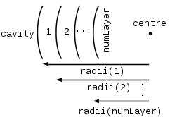

### `'ConvexHomoBody'`

This type is an approximate model for a convex body without a strong aspect 
ratio composed of homogeneous material. It is approximated by a sphere of the 
same surface area. The material parameter arrays should be either scalars or 
`numFreq x 1` vectors.

## Outputs

The supported absorber outputs in the different model states are:

output          | state  | type              | unit | description
:---------------|:------:|:-----------------:|:----:|:--------------------------
`tag`           | init   | string            | -    | name of absorber
`type`          | init   | string            | -    | type of absorber
`multiplicity`  | init   | integer scalar    | -    | number of absorbers
`parameters`    | init   | cell array        | -    | raw input parameters
`area`          | init   | double scalar     | m^2  | area of absorber
`ACS`           | init   | double vector [1] | m^2  | ACS of absorber
`AE`            | init   | double vector [1] | -    | AE of absorber
`absorbedPower` | solved | double vector [1] | W    | average net power absorbed

[1] These outputs are `numFreq x 1` column vectors. 

## Probability distributions

No probability distributions are supported for absorbers.

# Antennas

## Constructor

An antenna is added to a model using the function

    [ pwbm ] = pwbsAddAntenna( pwbm , tag , cavityTag , multiplicity , type , parameters )

where the arguments and return values are:

argument/return | type           | unit | description
:---------------|:--------------:|:----:|:--------------------------------------
`pwbm`          | structure      | -    | model state 
`tag`           | string         | -    | antenna name
`cavityTag `    | string         | -    | name of cavity containing the antenna
`multiplicity`  | integer scalar | -    | number of (identical) antennas to add
`type`          | string         | -    | type of antenna
`parameters`    | cell array     | -    | type specific parameter list

Positive net power is coupled *into* the antenna: It is therefore the average 
power received in the antenna load resistance.

The supported antenna types are:

`type`               | `parameters`
:--------------------|:---------------------------------------------
`'Matched'`          | `{ loadResistance }`
`'MismatchedAE'`     | `{ AE , loadResistance }`
`'MismatchedFileAE'` | `{ fileName , loadResistance }`
`'Monopole'`         | `{ length , radius , sigma , loadResistance }`
`'Dipole'`           | `{ length , radius , sigma , loadResistance }`

with parameters

parameter        | type              | unit | range |description
:----------------|:-----------------:|:----:|:-----:|:------------------------------------
`AE`             | double vector [1] | -    | >0    | average AE of antenna
`fileName`       | string            | -    | -     | name of ASCII file containing AE data
`length`         | double scalar     | m    | >0    | total length of monopole/dipole
`radius`         | double scalar     | m    | >0    | radius of monopole/dipole
`sigma`          | double vector [1] | -    | >0    | conductivity of monopole/dipole metal
`loadResistance` | double scalar     | ohm  | >0    | load resistance

[1] Must be either a scalar or an `numFreq x 1` column vector.

## Types

### `'Matched'`

For the matched type the absorption/antenna efficiency is unity.

### `'MismatchedAE'` & `'MismatchedFileAE'`

Mismatch antennas can be moddled by providing the absorption/antenna efficiency
asa parameters or from a two column ASCII data with the first column giving the 
frequency in hertz and the second column the AE.

### `'Monopole'` & `'Dipole'`

**[TBC]**

## Outputs

The supported antenna outputs in the different model states are

output           | state  | type              | unit | description
:----------------|:------:|:-----------------:|:----:|:-----------------------------------
`tag`            | init   | string            | -    | name of antenna
`type`           | init   | string            | -    | type of antenna
`multiplicity`   | init   | integer scalar    | -    | number of antennas
`parameters`     | init   | cell array        | -    | raw input parameters
`area`           | init   | double scalar     | m^2  | reception aperture of antenna
`ACS`            | init   | double vector [1] | m^2  | ACS of antenna
`AE`             | init   | double vector [1] | -    | AE of antenna
`loadResistance` | init   | double scalar     | ohm  | load resistance of antenna
`absorbedPower`  | solved | double vector [1] | W    | average net power absorbed/received

[1] These outputs are `numFreq x 1` column vectors. 

## Probability distributions

The supported quantities for output of probability distributions are:

quantity | unit | description
:--------|:----:|:------------------------------
`'Vr'`   | V    | real/imaginary part of voltage
`'V'`    | V    | magnitude of voltage
`'V2'`   | V    | squared magnitude of voltage
`'Ir'`   | A    | real/imaginary part of current
`'I'`    | A    | magnitude of current
`'I2'`   | A    | squared magnitude of current
`'P'`    | W    | power

# Sources

## Constructor

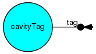 `'Direct'`, `'Antenna'` , `'DiffuseAperture'`  & `'PlanewaveAperture'`

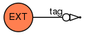 `'PowerDensity'` 

A source can be added to a model using the function

    [ pwbm ] = pwbsAddSource( pwbm , tag , objectType , objectTag , parameters )

where the arguments and return values are:

argument/return | type       | unit | description
:---------------|:----------:|:----:|:--------------------------------
`pwbm`          | structure  | -    | model state 
`tag`           | string     | -    | source name
`objectType`    | string     | -    | type of object acting as source
`objectTag`     | string     | -    | name of object acting as source
`parameters`    | cell array | -    | type specific parameter list

The supported source types are:

`type`                  | `objectType`   | `parameters`
:-----------------------|:--------------:|:-------------------------------------
`'Direct'`              | cavity         | `{ sourcePower }`
`'Antenna'`             |  antenna        | `{ sourcePower }`
`'DiffuseAperture'`     | aperture [1]   | `{ powerDensity }`
`'PlanewaveAperture'`   | aperture [1]   | `{ powerDensity , theta , phi , psi }`
`'SCFieldAperture'`     | aperture [1]   | `{ HxSC , HySC , EzSC }`
`'FileSCFieldAperture'` | aperture [1]   | `{ fileName }`
`'PowerDensity'`        | `'EXT'` cavity | `{ powerDensity }`

[1] The associated aperture must be coupling a cavity to the external environment `EXT`.

The parameters are:

parameter      | type              | unit   |  range   | description
:--------------|:-----------------:|:------:|:--------:|:------------------------------------------------------
`sourcePower`  | double vector [1] | W      | >0       | power of source
`powerDensity` | double vector [1] | W/m^2  | >0       | power density illuminating the aperture
`theta`        | double scalar     | degree | >=0,<180 | angle of incidence on aperture
`phi`          | double scalar     | degree | >=0,<360 | plane of incidence on aperture
`psi`          | double scalar     | degree | >=0,<=180| polarisation of electric field
`HxSC`         | double vector [1] | A/m    | >0       | x-polarised short-circuit magnetic field in aperture
`HySC`         | double vector [1] | A/m    | >0       | y-polarised short-circuit magnetic field in aperture
`EzSC`         | double vector [1] | V/m    | >0       | z-polarised short-circuit electric field in aperture
`fileName`     | string            | -      | -        | name of file containing short-circuit fields in aperture

[1] Must be either a scalar or an `numFreq x 1` column vector.

## Types

### `'Direct'`

For the direct source `sourcePower` is the delivered power into the cavity. 

### `'Antenna'`

For a source connected to an antenna `sourcePower` is the available power 
of the source which is reduced by the absorption efficiency of the antenna, `AE`, 
to give the power delivered into the cavity. The ACS of a n antenna acting as a 
source is also double by the `addAntenna` function call.

### `'DiffuseAperture'`

The diffuse aperture sources allow the diffuse power coupled through an aperture
from the external environment to be determined from the TCS of the associated aperture.
The parameter `powerDensity` defines the external power density and the average TCS 
of the aperture is then used to determine determine the power delivered to the cavity
through the aperture. Clearly this requires that the referenced apertures couples into
the external environment `EXT`. 

### `'PlanewaveAperture'`

This source allows the power coupled through an aperture coupling to the 
external environment from an external plane wave to be injected into the cavity. 
The angle of incidence and plane of incidence are defined by the polar angle 
(theta) and azimuthal angle (phi) of a spherical polar coordinate system defined 
according to the directions of the aperture polarisabilities. The polarisation 
angle (psi) is the angle between the electric field vector and the polar angle 
unit vector. The power density of the plane-wave corresponds to the incident 
field in the absence of the cavity.

**[TBC - check deifinition of psi]**

Currently plane-wave sources can only be applied to aperture types with defined 
polarisabilities.

### `'ShortCircuitField'` & `'FileShortCircuitField'`

**[TBC - check factors of 2 in SC and polarisabilities]**

### `'PowerDensity'`

Only one power density source can be defined and it must be attached to the 
virtual external environment object `'EXT'`. It makes the external environment 
act as a ''power density reservoir'', i.e any power delivered to, or taken from,
the external environment does not alter its power density. This essentially provides
a Thevenin equivalent for the `DiffuseAperture` source for coupling of an external
diffuse field through an aperture.

## Outputs

The supported source outputs in the different model states are:

output        | state  | type              | unit | description
:-------------|:------:|:-----------------:|:----:|:------------------------
`tag`         | init   | string            | -    | name of power source
`type`        | init   | string            | -    | type of power source
`parameters`  | init   | cell array        | -    | raw input parameters
`sourcePower` | solved | double vector [1] | W    | average delivered power 

[1] These outputs are `numFreq x 1` column vectors. 

## Probability distributions

No probability distributions are supported for sources.

# Scatterers

A scatterer can be added to a cavity using

    [ pwbm ] = pwbsAddScatterer( pwbm , tag , cavityTag , parameters )

where the arguments and return values are:

argument/return | type       | unit | description
:---------------|:----------:|:----:|:----------------------------
`pwbm`          | structure  | -    | model state 
`tag`           | string     | -    | scatterer name
`cavityTag`     | string     | -    | name of cavity to add to
`parameters`    | cell array | -    | yype specific parameter list

The supported scatterer types are:

`type`      | `parameters`
:-----------|:---------------------
`'Paddle'`  | `{ radius , height , SE }`
`'Generic'` | `{ SCS }`

with parameters

parameter | type              | unit | range | description
:---------|:------------------|------|:-----:|:--------------------------
`radius`  | double scalar     | m    | >0    | effective radius of paddle
`height`  | double scalar     | m    | >0    | effective height of paddle
`SE`      | double vector [1] | -    | >0    | SE of paddle
`SCS`     | double vector [1] | m^2  | >0    | effective SCS of scatterer

[1] Must be either a scalar or an `numFreq x 1` column vector.

## Outputs

No outputs are available for scatterers.

## Probability distributions

No probability distributions are supported for scatterers.

# Modelling Methodology

# Tips for efficiency

For large numbers of absorbers, apertures or antennas with the same parameters, 
for example, an array of holes forming a grill use the `multiplicity` arguments 
of the `Add` function, rather than adding many objects.

If adding objects that require high computation resource, such as spherical 
absorbers that use a Mie Series calculation, consider using the corresponding 
toolbox function to calculate the ACS and store it to a file and then use the 
basic object function that reads a CCS from file. This way the expensive 
calculation only needs to be done once.

It is recommended to create production models as functions which are called from 
the command line or from a script. Doing this can allow more advanced 
optimisation via the JIT compiler.

# Examples

## Nested reverberation chambers

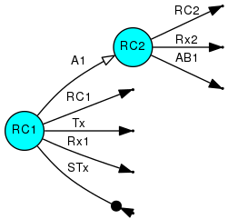

Function to solve nested reberation chambers PWB problem:

    function NRC()
    % Nested reverberation chambers.
    
      % Set frequencies to analyse.
      f = logspace( log10( 1e9 ) , log10( 100e9 ) , 100 );

      % Properties of first chamber.
      a_RC1 = 2.37;
      b_RC1 = 3.00;
      c_RC1 = 4.70;
      sigma_eff_RC1 = 0.16e6; 
      mu_r_RC1 = 1.0;

      % Properties of second chamber.
      a_RC2 = 0.6;
      b_RC2 = 0.7;
      c_RC2 = 0.8;
      sigma_eff_RC2 = 0.35e6;
      mu_r_RC2 = 1.0;
    
      % Radius of circular aperture between chambers.
      radius = 0.008;

      % Initialise model.
      pwbm = pwbsInitModel( f , 'NRC' );
      
      % Add the objects to the model.
      pwbm = pwbsAddCavity( pwbm , 'RC1' , 'Cuboid'  , ...
        { a_RC1 , b_RC1 , c_RC1 , sigma_eff_RC1 , mu_r_RC1 } );
      pwbm = pwbsAddCavity( pwbm , 'RC2' , 'Cuboid'  , ...
        { a_RC2 , b_RC2 , c_RC2 , sigma_eff_RC2 , mu_r_RC2 } );
      pwbm = pwbsAddAperture( pwbm , 'A1' , 'RC1' , 'RC2' , 1 , 'Circular' , { radius } );
      pwbm = pwbsAddAntenna( pwbm , 'Tx' , 'RC1' , 1 , 'Matched' , { 50 } );
      pwbm = pwbsAddAntenna( pwbm , 'Rx1' , 'RC1' , 1 , 'Matched' , { 50 } );
      pwbm = pwbsAddAntenna( pwbm , 'Rx2' , 'RC2' , 1 , 'Matched' , { 50 } );
      pwbm = pwbsAddSource( pwbm , 'STx', 'Antenna' , 'Tx' , { 1 } );
      pwbm = pwbsAddAbsorber( pwbm , 'AB1', 'RC2' , 1.0 , 'AE' , { 0.01 , 1.0 } );

      % Visualise the EMT.
      pwbsDrawEMT( pwbm );    
            
      % Setup the model.
      pwbm = pwbsSetupModel( pwbm );

      % Solve the model.
      pwbm = pwbsSolveModel( pwbm );
      
      % Export all the results to ASCII files.
      pwbsExportAll( pwbm );
     
      % Get the power density in each chamber.
      data = pwbsGetOutput( pwbm , 'Cavity' , 'RC1' , { 'powerDensity' } );
      IG_RC1 = data{1};
      data = pwbsGetOutput( pwbm , 'Cavity' , 'RC2' , { 'powerDensity' } );
      IG_RC2 = data{1};   
      
      % Calculate the shielding effectiveness (SE). 
      SE = IG_RC1 ./IG_RC2;
 
      % Save the model to a file.
      pwbsSaveModel( pwbm );
      
      % Plot the SE.
      figure();
      semilogx( f ./ 1e9 , 10 .* log10( SE ) , 'lineWidth' , 3 );
      xlabel( 'Frequency [Hz]' , 'fontSize' , 12 , 'fontName' , 'Helvetica' );
      ylabel( 'Shielding effectiveness, SE (dB)' , 'fontSize' , 12 , 'fontName' , 'Helvetica' );
      set( gca , 'XMinorTick' , 'on' , 'XMinorGrid', 'on' );
      set( gca , 'XTickLabel' , num2str( get( gca , 'XTick' )' ) );
      set( gca , 'fontSize' , 12 , 'fontName' , 'Helvetica' );
      ylim( [ 0 60 ] );
      grid( 'on' );
      
    end % function

The result of the model is shown below.

# References

[Liu1983]: http://nvlpubs.nist.gov/nistpubs/Legacy/TN/nbstechnicalnote1066.pdf 

([Liu1983]) B. H. Liu, D. C. Chang, and M. T. Ma, 
            "Eigenmodes and the Composite Quality Factor of a Reverberation Chamber", 
            NBS Technical Note 1066, National Institute of Standards and Technology, Boulder, Colorado, 1983

[ASCII]: https://en.wikipedia.org/wiki/ASCII

