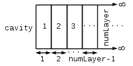
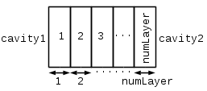
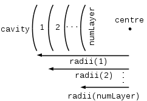
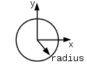
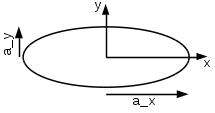
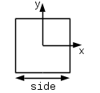
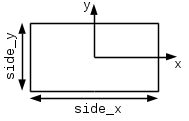
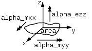
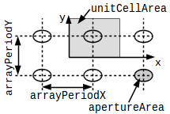

# AEG Power Balance Toolbox User Manual

I. D. Flintoft

Version 0.2, 12/05/2017

[TOC]

# Glossary

Acronym | Expansion
:-------|:----------------------------------------------
ACS     | Absorption cross-section
AE      | Absorption efficiency
CCDF    | Complementary cumulative distribution function
CCS     | Coupling cross-section
CDF     | Cumulative distribution function
CE      | Coupling efficiency
EMT     | Electromagnetic topology
GO      | Geometric optics
JIT     | Just-in-time
PDF     | Probability density function
PoA     | Point of absorption
PoC     | Point of coupling
PoE     | Point of entry/exit
PWB     | Power balance
SC      | Short circuited
SCS     | Scattering cross-section
SE      | Scattering efficiency
TCS     | Transmission cross-section
TE      | Transmission efficiency
TE      | Transverse electric
TM      | Transverse magnetic

# Utilities

## `pwbImportAndInterp`

The function

    [ data ] = pwbImportAndInterp( f , fileName )

loads and interpolates frequency dependent data from an ASCII file. The input 
ASCII file must have the format: 

    # Optional header/comment using initial # character. 
    # M+1 columns of real data with N rows
    # Column 1: Frequency [Hz].
    # Column 2: Data vector 1
    # ....................
    # Column ND+1: Data vector ND
    # f [Hz]  DV1 [-] .....  DVM [-] 
    ft(1)     DV1(1)          DVM(1) 
    ......    .....   .....   ......
    ft(N)     DV1(N)  .....   DVM(N)

The first frequency in the file, `ft(1)`, must be less than or equal to the lowest 
frequency in `f` and the last frequency in the file, `ft(N)`, must be greater than 
or equal to the highest frequency in `f`. The data at the frequencies given in 
the file are interpolated onto the frequencies requested. 

The arguments and return values are:

argument/return | type        | unit  | description
:---------------|:-----------:|:-----:|:------------------
`f`             | real vector | Hz    | frequencies
`fileName`      | string      | -     | input file name
`data`          | real array  | -     | interpolated data

## `pwbDistDiffuse`

The probability distributions of electromagnetic quantities in an ideally 
reverberant cavity can be determined using the function ([Hill1998][])

    [ x , y , meanQuantity , stdQuantity , quantQuantity ] = ...
      pwbDistDiffuse( quantity , dist , refValue )
    
The arguments and return values are:

argument/return | type        | unit  | description
:---------------|:-----------:|:-----:|:----------------------------
`quantity`      | string      | -     | physical quantity
`dist`          | string      | -     | distribution
`refValue`      | real scalar | -     | reference value for quantity  
`x`             | real vector | -     | abscissa of quantity
`y`             | real vector | -     | ordinate of quantity
`meanQuantity`  | real scalar | -     | mean of quantity
`stdQuantity`   | real scalar | -     | standard deviation of quantity
`quantQuantity` | real array  |       | quantiles  of quantity

`quantQuantity` is a two-dimensional array whose first row give values of the 
CDF and whose second row gives the quantiles. The 25-th, 50-th (median), 
75-th, 95-th and 99-th quantiles are returned.

Supported physical quantities are

`quantity` | description
:----------|------------------------------------------------------------------------
`'Fir'`    | real or imaginary part of a field component or received voltage/current
`'Fi'`     | magnitude of field component or received voltage/current
`'Fi2'`    | squared magnitude of field component or received power
`'F'`      | total field magnitude
`'F2'`     | square of total field magnitude, power density or energy density

Supported probability distributions are

`dist`   | description
:--------|------------------------------------------------------------------------
`'CDF'`  | cumulative distribution
`'CCDF'` | complementary cumulative distribution, reliability function
`'PDF'`  | probability density function

The required reference value for the different quantities are

`quantity` | required reference value
-----------|-----------------------------------------------------------------------------
`'Fir'`    | standard deviation of real/imaginary part of field component/voltage/current
`'Fi'`     | mean of magnitude of field component/voltage/current
`'Fi2'`    | mean square of field component magnitude/power
`'F'`      | mean of total field magnitude       
`'F2'`     | mean square of total field magnitude

## `pwbStatsDiffuse`

The statistics of electromagnetic quantities in an ideally reverberant cavity 
can be determined using the function ([Hill1998][])

    [ meanQuantity , stdQuantity quantQuantity ] = ...
      pwbStatsDiffuse( quantity , refValue )
    
The arguments and return values are:

argument/return | type        | unit  | description
:---------------|:-----------:|:-----:|:----------------------------
`quantity`      | string      | -     | physical quantity
`refValue`      | real scalar | -     | reference value for quantity  
`meanQuantity`  | real scalar | -     | mean of quantity
`stdQuantity`   | real scalar | -     | standard deviation of quantity
`quantQuantity` | real array  |       | quantiles  of quantity

`quantQuantity` is a two-dimensional array whose columns gives the 25-th, 
50-th (median), 75-th, 95-th and 99-th quantiles at each frequency.

Supported physical quantities are

`quantity` | description
:----------|------------------------------------------------------------------------
`'Fir'`    | real or imaginary part of a field component or received voltage/current
`'Fi'`     | magnitude of field component or received voltage/current
`'Fi2'`    | squared magnitude of field component or received power
`'F'`      | total field magnitude
`'F2'`     | square of total field magnitude, power density or energy density

The required reference value for the different quantities are

`quantity` | required reference value
-----------|-----------------------------------------------------------------------------
`'Fir'`    | standard deviation of real/imaginary part of field component/voltage/current
`'Fi'`     | mean of magnitude of field component/voltage/current
`'Fi2'`    | mean square of field component magnitude/power
`'F'`      | mean of total field magnitude       
`'F2'`     | mean square of total field magnitude

## `pwbGaussLegendreAngles`, `pwbGaussLegendreAverage` & `pwbGaussLegendreIntegral`

These functions provide support for integrating functions of spherical polar angles of
arrival and field polarisation angle over a sphere or hemisphere and over the polarisation
using Gauss-Legendre quadrature.

The spherical polar and polarisation sample angles for integrating are determined by 
the function 

    [ theta , phi , psi , weight ] = pwbGaussLegendreAngles( order , isCylindircal , ...
                                                             isHemisphere , isPlot )
                                                             
where the arguments and return values are:

argument/return | type           | unit  | description
:---------------|:--------------:|:-----:|:------------------------------------------
`order`         | string         | -     | order of quadrature, >=1
`isCylindircal` | boolean scalar | -     | true if cylindrical symmetry in phi  
`isHemisphere`  | boolean scalar | -     | true if restricted to z >= 0 hemisphere 
`isPlot`        | boolean scalar | -     | true if plot of sample directions required
`theta`         | real array     | rad   | polar sampling angles
`phi`           | real array     | rad   | azimuthal sampling angles
`psi`           | real array     | rad   | polarisation sampling angles
`weight`        | real array     | -     | Gauss-Legendre weights

Physics convention spherical coordinates are used with `theta` being the polar angle 
measured from the `z`-axis to the direction vector, `phi` being the azimuthal angle 
between the `x`-axis and the projection of the direction vector in the `x-y` plane. 
The polarisation angle, `psi`,  is measured from the minus `theta` direction according 
to the right-hand rule. All the return values are `N_theta x N_phi x N_psi` arrays. So, 
for example `theta(i,j,k)` is the value of the the polar angles for the sample corresponding 
to the `i`-th `theta` direction, `j`-th `psi` direction and `k`-th `psi` polarisation. 
Vectors of sampling angles can be obtained from:

    theta = squeeze( theta(:,1,1,) );
    psi = squeeze( psi(1,:,1) );
    psi  = squeeze( psi(1,1,:) );

The `kernel` of the function to be integrated should then be determined by the user at the 
sampling angles and the integral or average value determined using

    [ surfIntegral ] = pwbGaussLegendreIntegral( kernel , order , weight , ...
                                                 isCylindircal , isHemisphere );

    [ avgSurfIntegral ] = pwbGaussLegendreAverage( kernel , order , weight , ...
                                                   isCylindircal , isHemisphere );
    
where the additional arguments and return values are:

argument/return  | type        | unit  | description
:----------------|:-----------:|:-----:|:----------------------------------------------
`kernel`         | real array  | -     | kernel of the surface integral
`surfIntegral`   | real scalar | -     | integral over direction and polarisation angles
`avgSurfIntegral`| real scalar | -     | average over direction and polarisation angles  

The `kernel` array can have three forms:

1. A vector with the same number of elements as weight. In this case it is assumed
   to be a flattened array of samples with order corresponding to `theta(:)`, `phi(:)`,
   and `psi(:)`.
   
2. A two-dimensional array in which each row is assumed to be a flattened array of 
   samples with order corresponding to `theta(:)`, `phi(:)`, and `psi(:)`.
   
3. A three-dimensional array with the same shape as weight and with the samples
   in the corresponding positions.

Note that the average returned by `pwbGaussLegendreAverag()` is a mathematical average
and does not include the conventional factor of a half that appears in 
average cross-sections to account single-sided illumination. 

# Cavities

## Cavity modes

### `pwbCuboidCavityModeFreqs`

The frequencies of the modes in a cuboid cavity can be determined using the 
function ([Pozar2011][])

    [ f_c , ijkp ] = pwbCuboidCavityModeFreqs( f_max , a , b , c )

The arguments and return values are:

argument/return | type        | unit  | description
:---------------|:-----------:|:-----:|:------------------------------
`f_max`         | real scalar | Hz    | maximum mode frequency
`a`, `b`, `c`   | real scalar | m     | cuboid cavity side lengths
`f_c`           | real vector | Hz    | mode frequencies
`ikjp`          | real array  | -     | mode indices and polarisations

The mode frequencies `f_c` are returned in ascending order and include 
degenerate frequencies. Use `unique( f_c )` to eliminate degenerate frequencies 
if desired. The two dimensional array `ijkp(m,n)` describes the m-th mode:

column, `n` | type    | unit  | description
:-----------|:-------:|:-----:|:-------------------------------
1           | integer | -     | x-direction mode index
2           | integer | -     | y-direction mode index
3           | integer | -     | z-direction mode index
4           | integer | -     | mode polarisation TM(0) or TE (1)

### `pwbGenericCavityModesWeyl`, `pwbCuboidCavityModesLiu` & `pwbCuboidCavityModesCount`

The functions 

    [ numModes , modeDensity , f_1 , f_60 ] = pwbGenericCavityModesWeyl( f , volume )
    [ numModes , modeDensity , f_1 , f_60 ] = pwbCuboidCavityModesLiu( f , a , b , c )
    [ numModes , modeDensity , f_1 , f_60 ] = pwbCuboidCavityModesCount( f , a  , b , c )
    
estimate the cumulative number of modes and mode density in a cavity using 
different methods. `pwbGenericCavityModesWeyl` uses the basic Weyl formula for 
an arbitrary shaped cavity of known volume ([Weyl1912][]). 
`pwbCuboidCavityModesLiu` uses a more accurate estimate for a cuboid cavity 
([Liu1983][]) while `pwbCuboidCavityModesCount` applies exact mode counting for 
a cuboid cavity.

The arguments and return values are:

argument/return | type        | unit  | description
:---------------|:-----------:|:-----:|:--------------------------
`f`             | real vector | Hz    | frequencies
`volume`        | real scalar | m     | volume
`a`, `b`, `c`   | real scalar | m     | cuboid cavity side lengths
`numModes`      | real vector | -     | cumulative number of modes
`modeDensity`   | real vector | /Hz   | mode density
`f_1`           | real scalar | Hz    | frequency of first mode
`f_60`          | real scalar | Hz    | frequency of sixtieth mode

## `pwbGenericCavityWallACS`

The losses in the walls of a cavity can be determined using the function

    [ ACS , AE ] = pwbGenericCavityWallACS( f , area , volume , sigma , mu_r )

The function uses the uses a perturbative calculation of wall loss in a cuboid 
cavity parametrised in terms of the cavity volume and surface area ([Liu1983][]).

The arguments and return values are:

argument/return | type        | unit  | description
:---------------|:-----------:|:-----:|:---------------------------------
`f`             | real vector | Hz    | frequencies
`area`          | real scalar | m^2   | surface area
`volume`        | real scalar | m     | volume
`sigma`         | real vector | S/m   | electrical conductivity of walls
`mu_ r`         | real vector | -     | relative permeability of walls
`ACS`           | real vector | m^2   | average absorption cross-section of walls
`AE`            | real vector | -     | average absorption efficiency of walls

## `pwbWallLossFromMCIG`

The function

    [ ACS , AE , sigma_eff ] = pwbWallLossFromMCIG( f , area , volume , MCIG )

estimates the absorption cross-section, absorption efficiency and effective wall 
conductivity from the mismatch corrected insertion gain (MCIG) of a cavity 
containing only the two antennas used to determine the insertion gain. The 
function also assumes the relative permeability of the walls is unity.

The arguments and return values are:

argument/return | type        | unit  | description
:---------------|:-----------:|:-----:|:---------------------------------
`f`             | real vector | Hz    | frequencies
`area`          | real scalar | m^2   | surface area
`volume`        | real scalar | m     | volume
`MCIG`          | real vector | -     | mismatch corrected insertion loss
`ACS`           | real vector | m^2   | average absorption cross-section of walls
`AE`            | real vector | -     | average absorption efficiency of walls
`sigma_eff`     | real vector | S/m   | effective electrical conductivity of walls

## Energy loss parameters

The group of functions

    [ Q , decayRate , timeConst ] = pwbEnergyParamsFromCCS( f , CCS , volume ) 
    [ CCS , Q , timeConst ] = pwbEnergyParamsFromDecayRate( f , decayRate , volume )
    [ CCS , decayRate , timeConst ] = pwbEnergyParamsFromQ( f , Q , volume )
    [ CCS , decayRate , Q ] = pwbEnergyParamsFromTimeConst( f , timeConst , volume )
 
convert between different descriptions of the energy loss in the cavity 
([Hill2009][]).

The arguments and return values are:
 
argument/return | type        | unit  | description
:---------------|:-----------:|:-----:|:--------------------------
`f`             | real vector | Hz    | frequencies
`volume`        | real scalar | m     | volume
`CCS`           | real vector | m^2   | total loss CCS of cavity
`Q`             | real vector | -     | total composite Q factor
`decayRate`     | real vector | /s    | total energy decay rate
`timeConst`     | real vector | s     | total energy time constant

## `pwbCoupledCavities`

The function

    [ PD1 , PD2 , SR1 , SR2 , TACS1 , TACS2 ] = ...
      pwbCoupledCavities( ACS1 , ACS2 , TCS , Pt1 , Pt2 )

determines the power densities, shielding ratios and effective total absorption 
cross-sections of two coupled cavities.

The arguments and return values are:

argument/return | type        | unit  | description
:---------------|:-----------:|:-----:|:-------------------------------------------------
`ACS1`          | real vector | m^2   | absorption cross-section of losses cavity 1
`ACS2`          | real vector | m^2   | absorption cross-section of losses cavity 2
`TCS`           | real vector | m^2   | transmission cross-section between cavities
`Pt1`           | real vector | W     | power injected into cavity 1
`Pt2`           | real vector | W     | power injected into cavity 2
`PD1`           | real vector | W/m^2 | power density in cavity 1
`PD2`           | real vector | W/m^2 | power density in cavity 2
`SR1`           | real vector | -     | shielding ratio of cavity 1 [1]
`SR2`           | real vector | -     | shielding ratio of cavity 2 [1]
`TACS1`         | real vector | m^2   | total absorption cross-section seen from cavity 1
`TACS2`         | real vector | m^2   | total absorption cross-section seen from cavity 2

[1] The shielding ratio is defined as the ratio of the scalar power densities in the cavties.

# Antennas

## `pwbAntenna`

The funtcion

    [ ACS , AE ] = pwbAntenna( f , isTx , AE )

determines the average absorption cross-section and efficiency of an antenna. 
Transmitting antennas have twice the absorption cross-section of receiving 
antennas due to coherent enhanced back-scattering 
([Ladbury2007][],[Junqua2012][]).

The arguments and return values are:

argument/return | type            | unit | description
:---------------|:---------------:|:----:|:-----------------------------------
`f`             | real vector     | Hz   | frequencies
`isTx`          | boolean         | -    | true if transmitting antenna
`AE`            | real vector [1] | -    | total antenna/absorption efficiency
  
[1] Scalar of the same length as `f`.

# Absorbers

## `pwbMetalSurface`

The function 

    [ ACS , AE ] = pwbMetalSurface( f , area , sigma , mu_r )

determines the average absorption cross-section and efficiency of a highly 
conducting surface by averaging the reflectance determined from the Fresnel 
coefficients over the angles of arrival and the polarisations 
([Orfanidis2016][]). The surface is assumed to be much deeper than the skin
depth.
       
The input arguments and output values are:

argument/return | type               | unit  | description
:---------------|:------------------:|:-----:|:-------------------------
`f`             | real vector        | Hz    | frequencies
`area`          | real scalar        | m^2   | area
`sigma`         | real vector [1]    | S/m   | conductivity
`mu_r`          | real vector [1]    | -     | relative permeability
`ACS`           | real vector        | m^2   | absorption cross-section
`AE`            | real vector        | -     | absorbers efficiency

[1] The material vectors must be either scalars for frequency independent 
parameters or have the same length as `f` for frequency dependent parameters.

## `pwbDielectricSurface`

The function 

    [ ACS , AE ] = pwbDielectricSurface( f , area , eps_r , sigma , mu_r )

determines the average absorption cross-section and efficiency of a lossy 
dielectric surface by averaging the reflectance determined from the Fresnel 
coefficients over the angles of arrival and the polarisations 
([Orfanidis2016][]). The surface is assumed to be much deeper than the skin
depth.
        
The input arguments and output values are:

argument/return | type               | unit  | description
:---------------|:------------------:|:-----:|:-----------------------------
`f`             | real vector        | Hz    | frequencies
`area`          | real scalar        | m^2   | area
`eps_r`         | complex vector [1] | -     | complex relative permittivity
`sigma`         | real vector [1]    | S/m   | conductivity
`mu_r`          | real vector [1]    | -     | relative permeability
`ACS`           | real vector        | m^2   | absorption cross-section
`AE`            | real vector        | -     | absorbers efficiency

[1] The material vectors must be either scalars for frequency independent 
parameters or have the same length as `f` for frequency dependent parameters.

## `pwbLaminatedSurface`

The function 

    [ ACS , AE ] = ...
      pwbLaminatedSurface( f , area , thicknesses , eps_r , sigma , mu_r , sigmam )

determines the (average) absorption cross-section and efficiency of a lossy 
multilayer surface. It uses a multi-layer reflection and transmission code to 
determine the reflectance at oblique incidence for TE and TM polarisations and 
then averages over the angles of arrival and the polarisations 
([Orfanidis2016][]).
        
The input arguments and output values are:

argument/return | type              | unit  | description
:---------------|:-----------------:|:-----:|:---------------------------------------
`f`             | real vector       | Hz    | frequencies
`area`          | real scalar       | m^2   | area
`thicknesses`   | real vector       | m     | thicknesses of layers, outer first
`eps_r`         | complex array [1] | -     | complex relative permittivity of layers
`sigma`         | real array [1]    | S/m   | conductivities of layers
`mu_r`          | real array [1]    | -     | relative permeabilities of layers
`sigmam`        | real array [1]    | ohm/m | magnetic conductivities of layers
`ACS`           | real vector       | m^2   | absorption cross-section
`AE`            | real vector       | -     | absorbers efficiency

[1] The material arrays must have `numLayer` columns and either one row for 
frequency independent parameters or the same number of rows as the length of `f` 
for frequency dependent parameters.

## `pwbLucentSheet`

The function 

    [ ACS , AE ] = pwbLucentSheet( f , area , thicknesses , eps_r , sigma , mu_r )

determines the average absorption cross-section and efficiency of a finite sized
thin lossy sheet that is wholly contained within a cavity. It uses a multi-layer 
reflection and transmission code to determine the reflectance and transmittance at 
oblique incidence for TE and TM polarisations and then averages over the angles of 
arrival and the polarisations ([Orfanidis2016][]). The model treats each side 
separately and applies a geometric optics approximation that does not account for 
diffraction effects from the sheet edges.

The input arguments and output values are:

argument/return | type              | unit  | description
:---------------|:-----------------:|:-----:|:--------------------------------------------
`f`             | real vector       | Hz    | frequencies
`area`          | real scalar       | m^2   | area of one side of the sheet [2]
`thicknesses`   | real vector       | m     | thicknesses of layers, side 1 first
`eps_r`         | complex array [1] | -     | complex relative permittivity of layers
`sigma`         | real array [1]    | S/m   | conductivities of layers
`mu_r`          | real array [1]    | -     | relative permeabilities of layers
`ACS`           | real vector       | m^2   | absorption cross-section [2]
`AE `           | real vector       | -     | absorption efficiency [2]

[1] The material arrays must have `numLayer` columns and either one row for 
frequency independent parameters or the same number of rows as the length of `f` 
for frequency dependent parameters.

[2] The input `area` should be that of one side of the sheet only. The output
absorption cross-section `ACS` and efficiency `AE` are for both sides of the sheet.

## `pwbSphere`

The function 

    [ ACS , AE ] = pwbSphere( f , radius , eps_r , sigma , mu_r )

determines the (average) absorption cross-section and efficiency of a lossy 
homogeneous sphere. It uses a Mie Series calculation to determine the 
absorption efficiency. Interfaces are provide for a number of different Mie 
codes which can be called explicitly using

    [ ACS , AE ] = pwbLaminatedSphere_Matzler( f , radius , eps_r , sigma , mu_r )
    [ ACS , AE ] = pwbLaminatedSphere_Markowicz( f , radius , eps_r , sigma , mu_r )
    
The generic function `pwbSphere` chooses the best available code it can find.  
        
The input arguments and output values are:

argument/return | type            | unit | description
:---------------|:---------------:|:----:|:------------------------------
`f`             | real vector     | Hz   | frequencies
`radius`        | real scalar     | m    | radius of sphere 
`eps_r`         | complex vector  | -    | complex relative permittivity
`sigma`         | real vector [1] | S/m  | conductivity
`mu_r`          | real vector [1] | -    | relative permeability
`ACS`           | real vector     | m^2  | absorption cross-section
`AE`            | real vector     | -    | absorbers efficiency

[1] Either a scalar of vector with the same length as `f`.

### `pwbSphere_Matzler`

This version of the function uses Christian Matzler's MATLAB code 
([Matzler2002][],[Prahl2016][]).

### `pwbSphere_Markowicz`

This version of the function uses a MATLAB implementation of Bohren and 
Huffman's code ([Bohren2004][],[Markowicz2016][]).

## `pwbLaminatedSphere`

The function 

    [ ACS , AE ] = pwbLaminatedSphere( f , radii , eps_r , sigma , mu_r )

determines the (average) absorption cross-section and efficiency of a lossy 
multilayer sphere. It uses a Mie Series calculation to determine the 
absorption efficiency. Interfaces are provide for a number of different Mie 
codes which can be called explicitly using

    [ ACS , AE ] = pwbLaminatedSphere_SPlaC( f , radii , eps_r , sigma , mu_r )
    [ ACS , AE ] = pwbLaminatedSphere_PenaPal( f , radii , eps_r , sigma , mu_r )
    [ ACS , AE ] = pwbLaminatedSphere_PenaPalM( f , radii , eps_r , sigma , mu_r )
    
The generic function `pwbLaminatedSphere` chooses the best available code it can 
find.  
        
The input arguments and output values are:

argument/return | type              | unit | description
:---------------|:-----------------:|:----:|:---------------------------------------
`f`             | real vector       | Hz   | frequencies
`radii`         | real vector       | m    | radii of layers 
`eps_r`         | complex array [1] | -    | complex relative permittivity of layers
`sigma`         | real array [1]    | S/m  | conductivities of layers
`mu_r`          | real array [1]    | -    | relative permeabilities of layers
`ACS`           | real vector       | m^2  | absorption cross-section
`AE`            | real vector       | -    | absorbers efficiency

[1] The material arrays must have `numLayer` columns and either one row for 
frequency independent parameters or the same number of rows as the length of `f` 
for frequency dependent parameters.

### `pwbLaminatedSphere_SPlaC`

This version of the function uses the SERS and Plasmonics Codes (SPlaC) package 
([SPlaC][],[LeRu2009][]). If appears to give the large dynamic range with 
respect to the loss and electrical size of the sphere. 

### `pwbLaminatedSphere_PenaPal`

This version of the function uses the C program from Pena and Pal's more recent 
`scattnlay` package ([scattnlay_v2][],[Pena2009][]). It appears to provide a 
moderate dynamic range with respect to the loss and electrical size of the 
sphere.

### `pwbLaminatedSphere_PenaPalM`

This version of the function uses the MATLAB program from Pena and Pal's 
original `scattnlay` package ([scattnlay_v1][],[Pena2009][]). It appears to 
provide a moderate dynamic range with respect to the loss and electrical size of 
the sphere.

# Apertures

Note: TCSs and TEs used in the toolbox follow the convention of including the 
factor of half from the half-space illumination in the cross-section itself. 
Taking the product of the power density in the cavity with such a TCS therefore 
directly yields the power coupled through the aperture without needing a factor 
of a half to be included.

## Aperture polarisabilities

### `pwbApertureCircularPol`

A circular aperture is defined by its `radius` ([Hill2009][]).

    [ area , alpha_mxx , alpha_myy , alpha_ezz ] = pwbApertureCircularPol( radius )

parameter     | type              | unit | description
:-------------|:-----------------:|:----:|:---------------------------------------------
`radius`      | double scalar     | m    | radius of circular aperture
`area`        | double scalar     | m^2  | area of aperture
`alpha_mxx`   | double scalar     | m^3  | x-component of magnetic polarisability tensor
`alpha_myy`   | double scalar     | m^3  | y-component of magnetic polarisability tensor
`alpha_ezz`   | double scalar     | m^3  | z-component of electric polarisability tensor

### `pwbApertureEllipticalPol`

An elliptical aperture is defined by its semi-axes along the x- and 
y-directions, `a_x` and `a_y` ([DeMeulenaere1977][])

    [ area , alpha_mxx , alpha_myy , alpha_ezz ] = ...
       pwbApertureEllipticalPol( a_x , b_y )

parameter     | type              | unit | description
:-------------|:-----------------:|:----:|:-----------------------------------------------
`a_x`         | double scalar     | m    | semi-axis of elliptical aperture in x-direction
`a_y`         | double scalar     | m    | semi-axis of elliptical aperture in y-direction
`area`        | double scalar     | m^2  | area of aperture
`alpha_mxx`   | double scalar     | m^3  | x-component of magnetic polarisability tensor
`alpha_myy`   | double scalar     | m^3  | y-component of magnetic polarisability tensor
`alpha_ezz`   | double scalar     | m^3  | z-component of electric polarisability tensor    

### `pwbApertureSquarePol`

A square aperture is defined by its `side` length

    [ area , alpha_mxx , alpha_myy , alpha_ezz ] = pwbApertureSquarePol( side )

The function determines the polarisabilities as those of a circular aperture 
with the same area.

parameter   | type              | unit | description
:-----------|:-----------------:|:----:|:---------------------------------------------
`side`      | double scalar     | m    | side length of aperture
`area`      | double scalar     | m^2  | area of aperture
`alpha_mxx` | double scalar     | m^3  | x-component of magnetic polarisability tensor
`alpha_myy` | double scalar     | m^3  | y-component of magnetic polarisability tensor
`alpha_ezz` | double scalar     | m^3  | z-component of electric polarisability tensor  

### `pwbApertureRectangularPol`, `pwbApertureRectangularPol2`

A rectangular aperture is defined by its side lengths along the x- and 
y-directions, `side_x` and `side_y`

    [ area , alpha_mxx , alpha_myy , alpha_ezz ] = ...
      pwbApertureRectangularPol( side_x , side_y )
      
    [ area , alpha_mxx , alpha_myy , alpha_ezz ] = ...
      pwbApertureRectangularPol2( side_x , side_y )

The first version of the function `pwbApertureRectangularPol` determines the 
polarisabilities as those of an elliptical aperture with the same area and 
aspect ratio. The second version `pwbApertureRectangularPol2` uses a parametric 
fit to simulation data ([McDonald1985][],[McDonald1987][],[McDonald1988][]).

parameter     | type              | unit | description
:-------------|:-----------------:|:----:|:--------------------------------------------------
`side_x`      | double scalar     | m    | side length of rectangular aperture in x-direction
`side_y`      | double scalar     | m    | side length of rectangular aperture in y-direction
`area`        | double scalar     | m^2  | area of aperture
`alpha_mxx`   | double scalar     | m^3  | x-component of magnetic polarisability tensor
`alpha_myy`   | double scalar     | m^3  | y-component of magnetic polarisability tensor
`alpha_ezz`   | double scalar     | m^3  | z-component of electric polarisability tensor  

## `pwbApertureTCS`

The function

    [ TCS , TE , f_c ] = pwbApertureTCS( f , area , alpha_mxx , alpha_myy , alpha_ezz )

determines the average transmission cross-section of an aperture from its area 
and electric and magnetic polarisabilities ([Hill1994][]). 

The input arguments and output values are:

argument/return | type          | unit | description
:---------------|:-------------:|:----:|:---------------------------------------------
`f`             | real vector   | Hz   | frequencies
`area`          | real scalar   | m^2  | area
`alpha_mxx`     | double scalar | m^3  | x-component of magnetic polarisability tensor
`alpha_myy`     | double scalar | m^3  | y-component of magnetic polarisability tensor
`alpha_ezz`     | double scalar | m^3  | z-component of electric polarisability tensor
`TCS`           | real vector   | m^2  | transmission cross-section
`TE`            | real vector   | -    | transmission efficiency

## `pwbApertureArrayTCS`

** This function is still experimental and not validated **

The function

    [ TCS , TE ] = pwbApertureArrayTCS( f , arrayArea , arrayPeriodX , arrayPeriodY , ...
                                        unitCellArea , thickness , apertureArea , ...
                                        alpha_mxx , alpha_myy , alpha_ezz [ , cutOffFreq ] )

determines the average transmission cross-section of a large array of apertures from their
periodicities and individual properties ([Paoletti2012][]). 

The input arguments and output values are:

argument/return     | type            | unit | description
:-------------------|:---------------:|:----:|:--------------------------------------------------------
`f`                 | real vector     | Hz   | frequencies
`arrayArea`         | real scalar     | m^2  | area of the whole array
`arrayPeriodX`      | real scalar     | m    | period of the primitive unit cell in x direction
`arrayPeriodY`      | real scalar     | m    | period of the primitive unit cell in y direction
`unitCellArea`      | real scalar     | m^2  | area of the primitive unit cell 
`thickness`         | real scalar     | m    | thickness of plate
`apertureArea`      | real scalar     | m^2  | area of a single aperture
`alpha_mxx`         | double scalar   | m^3  | x-component of magnetic polarisability tensor
`alpha_myy`         | double scalar   | m^3  | y-component of magnetic polarisability tensor
`alpha_ezz`         | double scalar   | m^3  | z-component of electric polarisability tensor
`cutOffFreq`        | double scalar   | Hz   | cut-off frequency of aperture fundamental waveguide mode
`TCS`               | real vector     | m^2  | transmission cross-section of the array
`TE`                | real vector     | -    | transmission efficiency of the array

## `pwbPerforatedScreen`

** This function is still experimental and not validated **

The function

    [ TCS , TE ] = pwbPerforatedScreen( f , arrayArea , arrayPeriod , apertureArea )

estimates the average transmission cross-section of a large area of metal plate perforated 
with a two-dimensional array of low aspect ratio apertures ([Lee1982][]).

The input arguments and output values are:

argument/return  | type         | unit | description
:----------------|:------------:|:----:|:-------------------------------------------------
`f`              | real vector  | Hz   | frequencies
`arrayArea`      | real scalar  | m^2  | area of the whole array
`arrayPeriod`    | real scalar  | m    | period of the primitive unit cell in x direction
`apertureArea`   | real scalar  | m^2  | area of a single aperture
`TCS`            | real vector  | m^2  | transmission cross-section of the array
`TE`             | real vector  | -    | transmission efficiency of the array

## `pwbLucentWall`

The function 

    [ ACS1 , ACS2 , RCS1 , RCS2 , TCS , AE1 , AE2 , RE1 , RE2 , TE ] = ...
                pwbLucentWall( f , area , thicknesses , eps_r , sigma , mu_r )

determines the average absorption, reflection and transmission cross-sections and 
efficiencies of a lossy multilayer wall between two cavities. It uses a multi-layer 
reflection and transmission code to determine the reflectance at oblique incidence for 
TE and TM polarisations and then averages over the angles of arrival and the 
polarisations ([Orfanidis2016][]).

The input arguments and output values are:

argument/return | type              | unit  | description
:---------------|:-----------------:|:-----:|:--------------------------------------------
`f`             | real vector       | Hz    | frequencies
`area`          | real scalar       | m^2   | area of one side of the wall
`thicknesses`   | real vector       | m     | thicknesses of layers, side 1 first
`eps_r`         | complex array [1] | -     | complex relative permittivity of layers
`sigma`         | real array [1]    | S/m   | conductivities of layers
`mu_r`          | real array [1]    | -     | relative permeabilities of layers
`ACS1`          | real vector       | m^2   | absorption cross-section of side 1 [2]
`ACS2`          | real vector       | m^2   | absorption cross-section of side 2 [2]
`RCS1`          | real vector       | m^2   | reflection cross-section of side 1
`RCS2`          | real vector       | m^2   | reflection cross-section of side 2
`TCS`           | real vector       | m^2   | transmission cross-section
`AE1`           | real vector       | -     | absorption efficiency of side 1 [2]
`AE2`           | real vector       | -     | absorption efficiency of side 2 [2]
`RE1`           | real vector       | -     | reflection efficiency of side 1
`RE2`           | real vector       | -     | reflection efficiency of side 2
`TE`            | real vector       | -     | transmission efficiency

[1] The material arrays must have `numLayer` columns and either one row for 
frequency independent parameters or the same number of rows as the length of `f` 
for frequency dependent parameters.

[2] The absorption cross-sections and efficiencies give the power actually
dissipated within the laminated wall for a source on each side and do not include 
the power lost to the cavity on each side of the wall due to transmission through 
the wall to the other side. So, for example, the effective power lost from the 
cavity on side 1 is determined by `1 - RCS1`, with the proportion transferred to
cavity 2 determined by `TCS1` and that actually dissipated in the wall determined
by `ACS1`.

# References

[Bohren2004]: http://onlinelibrary.wiley.com/book/10.1002/9783527618156

([Bohren2004]) C. F. Bohren and D. R. Huffman, "Absorption and Scattering of 
Light by Small Particles", Wiley-VCH Verlag GmbH & Co. KGaA, Weinheim, 2004.

[Butler1978]: http://ieeexplore.ieee.org/document/1141788

([Butler1978]) C. Butler, Y. Rahmat-Samii and R. Mittra, “Electromagnetic 
penetration through apertures in conducting surfaces”, IEEE Transactions on 
Antennas and Propagation, vol. 26, no. 1, pp. 82–93, Jan 1978.

[DeMeulenaere1977]: http://ieeexplore.ieee.org/document/1141568

([DeMeulenaere1977]) F. De Meulenaere and J. Van Bladel, “Polarizability of some 
small apertures”, IEEE Transactions on Antennas and Propagation, vol.25, no.2, 
pp. 198- 205, Mar 1977.

[Hill1993]: http://nvlpubs.nist.gov/nistpubs/Legacy/TN/nbstechnicalnote1361.pdf

([Hill1993]) D. A. Hill, J. W. Adams, M. T. Ma, A. R. Ondrejka and B. F. Riddle, 
"Aperture excitation of electrically large, lossy cavities", NIST Technical Note 
1361, Sept, 1993.

[Hill1996]: http://ieeexplore.ieee.org/document/544314/

([Hill1996]) D. A. Hill, "A reflection coefficient derivation for the Q of a 
reverberation chamber", IEEE Transactions on Electromagnetic Compatibility, vol. 
38, no. 4, pp. 591-592, Nov 1996.

[Hill1998]: http://ieeexplore.ieee.org/document/709418/

([Hill1998]) D. A. Hill, "Plane wave integral representation for fields in 
reverberation chambers", IEEE Transactions on Electromagnetic Compatibility, 
vol. 40, no. 3, pp. 209-217, Aug 1998.

[Hill1994]: http://ieeexplore.ieee.org/document/305461

([Hill1994]) D. A. Hill, M. T. Ma, A. R. Ondrejka, B. F. Riddle, M. L. Crawford 
and R. T. Johnk, "Aperture excitation of electrically large, lossy cavities", 
IEEE Transactions on Electromagnetic Compatibility, vol. 36, no. 3, pp. 169-178, 
Aug 1994.

[Hill2009]: http://eu.wiley.com/WileyCDA/WileyTitle/productCd-0470495049.html

([Hill2009]) D. A. Hill, "Electromagnetic fields in cavities: deterministic and 
statistical theories", IEEE Press Series on Electromagntic Wave Theory, John 
Wiley & Sons, 2009.

[Junqua2012]: http://ieeexplore.ieee.org/document/6151920

([Junqua2012]) I. Junqua, P. Degauque, M. Liénard, and F. Issac, “On the power 
dissipated by an antenna in transmit mode or in receive mode in a reverberation 
chamber”, Electromagnetic Compatibility, IEEE Transactions on, vol.54, no.1, 
pp.174-180, February 2012. 

[Kostas1991]: http://ieeexplore.ieee.org/document/99120

([Kostas1991]) J. Kostas and B. Boverie, “Statistical model for a mode-stirred 
chamber”, IEEE Transactions on Electromagnetic Compatibility, vol. 33, no. 4, 
pp. 366–370, November 1991.

[Ladbury2007]: http://ieeexplore.ieee.org/document/4305781

([Ladbury2007]) J. M. Ladbury and D. A. Hill, “Enhanced backscatter in a 
reverberation chamber: Inside every complex problem is a simple solution 
struggling to get out”, IEEE International Symposium onElectromagnetic 
Compatibility 2007, pp. 1-5, 9-13 July 2007. 

[Ladbury2010]: http://ieeexplore.ieee.org/document/5711356

[Ladbury2010] J. M. Ladbury and D. A. Hill, “An improved model for antennas in 
reverberation chambers”, IEEE International Symposium on Electromagnetic 
Compatibility 2010, pp. 663-667, 25-30 July 2010.

[Lee1982]: http://ieeexplore.ieee.org/document/1142923

([Lee1982]) S.-W. Lee, G. Zarrillo and C.-L. Law, "Simple formulas for 
transmission through periodic metal grids or plates", IEEE Transactions 
on Antennas and Propagation, vol. 30, no. 5, pp. 904-909, Sep 1982.

[LeRu2009]: http://store.elsevier.com/product.jsp?isbn=9780080931555
 
([LeRu2009]) E. C. Le Ru and P. G. Etchegoin, Principles of Surface-Enhanced 
Raman Spectroscopy and Related Plasmonic Effects, Elsevier, Amsterdam, 2009.

[Ladbury2010]: http://ieeexplore.ieee.org/document/5711356

([Ladbury2010]) J. M. Ladbury and D. A. Hill, “An improved model for antennas in 
reverberation chambers”, IEEE International Symposium on Electromagnetic 
Compatibility 2010, pp. 663-667, 25-30 July 2010.

[Liu1983]: http://nvlpubs.nist.gov/nistpubs/Legacy/TN/nbstechnicalnote1066.pdf 

([Liu1983]) B. H. Liu, D. C. Chang, and M. T. Ma, "Eigenmodes and the Composite 
Quality Factor of a Reverberation Chamber", NBS Technical Note 1066, National 
Institute of Standards and Technology, Boulder, Colorado, 1983.
            
[Markowicz2016]: http://code.google.com/p/scatterlib/wiki/Spheres

([Markowicz2016]) K. Markowicz, in "scatterlib" (August 16, 2016), URL: 
http://code.google.com/p/scatterlib/wiki/Spheres.

[Matzler2002]: http://www.atmo.arizona.edu/students/courselinks/spring08/atmo336s1/courses/spring09/atmo656b/maetzler_mie_v2.pdf

([Matzler2002]) C. Mätzler, "MATLAB functions for Mie scattering and 
absorption", Res. Rep. 2002-08, Inst. für Angew. Phys., Bern., 2002.

[McDonald1985]: http://ieeexplore.ieee.org/document/1133186

([McDonald1985]) N. A. McDonald, “Polynomial Approximations for the Electric 
Polarizabilities of Some Small Apertures”, IEEE Transactions on Microwave Theory 
and Techniques, vol.33, no.11, pp. 1146-1149, Nov 1985.

[McDonald1987]: http://ieeexplore.ieee.org/document/1133589

([McDonald1987]) N. A. McDonald, “Polynomial Approximations for the Transverse 
Magnetic Polarizabilities of Some Small Apertures”, IEEE Transactions on 
Microwave Theory and Techniques, vol.35, no.1, pp. 20- 23, Jan 1987.

[McDonald1988]: http://ieeexplore.ieee.org/document/3648

([McDonald1988]) N. A. McDonald, “Simple approximations for the longitudinal 
magnetic polarizabilities of some small apertures”, IEEE Transactions on 
Microwave Theory and Techniques, vol.36, no.7, pp.1141-1144, Jul 1988.

[Orfanidis2016]: http://www.ece.rutgers.edu/~orfanidi/ew

([Orfanidis2016]) S. J. Orfanidis, "Electromagnetic waves and antennas", Rutgers 
University, New Brunswick, NJ , 2016. URL: 
http://www.ece.rutgers.edu/~orfanidi/ewa.

[Paoletti2012]: http://dx.doi.org/10.1109/APEMC.2012.6237888

([Paoletti2012]) U. Paoletti, T. Suga and H. Osaka, "Average transmission cross 
section of aperture arrays in electrically large complex enclosures", 2012 
Asia-Pacific Symposium on Electromagnetic Compatibility, Singapore, 2012, pp. 677-680.

[Pena2009]: http://www.sciencedirect.com/science/article/pii/S0010465509002306

([Pena2009]) O. Pena and U. Pal, "Scattering of electromagnetic radiation by a 
multilayered sphere", Computer Physics Communications, vol. 180, Nov. 2009, pp. 
2348-2354.

[Pozar2011]: http://eu.wiley.com/WileyCDA/WileyTitle/productCd-EHEP002016.html

([Pozar2011]) D. M. Pozar, "Microwave Engineering", 4th edition, John Wiley & 
Sons; 2011.

[Prahl2016]: http://omlc.org/software/mie

([Prahl2016]) S. Prahl, Mie Scattering codes web page, URL: 
http://omlc.org/software/mie

[scattnlay_v1]: http://cpc.cs.qub.ac.uk/cpc/cgi-bin/showversions.pl/?catid=AEEY&usertype=toolbar&deliverytype=view.

([scattnlay_v1]) Computer Physics Communications Program Library, AEEY_v1_0, 
URL: http://cpc.cs.qub.ac.uk/cpc/cgi-bin/showversions.pl/?catid=AEEY&usertype=toolbar
&deliverytype=view.

[scattnlay_v2]: https://github.com/ovidiopr/scattnlay

([scattnlay_v2]) github, scattnlay source code. URL: 
https://github.com/ovidiopr/scattnlay.

[SPlaC]: http://www.victoria.ac.nz/scps/research/research-groups/raman-lab/numerical-tools/sers-and-plasmonics-codes 

([SPlaC]) SERS and Plasmonics Codes, SPlaC, University of Victoria, URL: 
http://www.victoria.ac.nz/scps/research/research-groups/raman-lab/numerical-tools/sers-and-plasmonics-codes

[Weyl1912]: http://link.springer.com/article/10.1007/BF01456804

([Weyl1912]) H. Weyl, Mathematische Annalen, vol. 71, no. 4, pp. 441-479, 1912.
