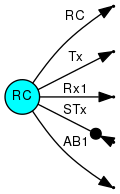
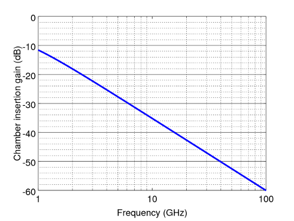
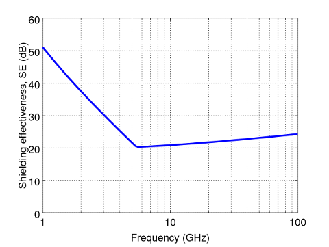

# AEG Power Balance Solver Tutorial

I. D. Flintoft

Version 0.1, 16/08/2016

[TOC]

# Single cavity with two antennas

Function to solve nested reberation chambers PWB problem:

    function RC()

      % Set frequencies to analyse.
      f = logspace( log10( 1e9 ) , log10( 100e9 ) , 100 );

      % Properties of chamber.
      a_RC = 2.37;
      b_RC = 3.00;
      c_RC = 4.70;
      sigma_eff_RC = 0.16e6; 
      mu_r_RC = 1.0;

      % Initial model.
      pwbm = pwbsInitModel( f , 'RC' );
      
      % Add the objects to the model.
      pwbm = pwbsAddCavity( pwbm , 'RC' , 'Cuboid'  , ...
        { a_RC , b_RC , c_RC , sigma_eff_RC , mu_r_RC } );
      pwbm = pwbsAddAntenna( pwbm , 'Tx' , 'RC' , 1 , 'Matched' , { 50 } );
      pwbm = pwbsAddAntenna( pwbm , 'Rx1' , 'RC' , 1 , 'Matched' , { 50 } );
      pwbm = pwbsAddSource( pwbm , 'STx', 'Antenna' , 'Tx' , { 1 } );
      pwbm = pwbsAddAbsorber( pwbm , 'AB1', 'RC' , 1.0 , 'AE' , { 0.01 , 1.0 } );
   
      % Visualise the EMT.
      pwbsDrawEMT( pwbm );    
      
      % Solve the model.
      pwbm = pwbsSolveModel( pwbm );
         
      % Export all the results to ASCII files.
      pwbsExportAll( pwbm );
     
      % Get the power density in each chamber.
      data = pwbsGetOutput( pwbm , 'Antenna' , 'Rx1' , { 'absorbedPower' } );
      IG_RC = data{1};
       
      % Save the model to a file.
      pwbsSaveModel( pwbm );
      
      figure();
      semilogx( f ./ 1e9 , 10 .* log10( IG_RC ) , 'lineWidth' , 3 );
      xlabel( 'Frequency [Hz]' , 'fontSize' , 18 , 'fontName' , 'Helvetica' );
      ylabel( 'Chamber insertion gain (dB)' , 'fontSize' , 18 , 'fontName' , 'Helvetica' );
      set( gca , 'XMinorTick' , 'on' , 'XMinorGrid', 'on' );
      set( gca , 'XTickLabel' , num2str( get( gca , 'XTick' )' ) );
      set( gca , 'fontSize' , 18 , 'fontName' , 'Helvetica' );
      ylim( [ -60 0 ] );
      grid( 'on' );
      
    end % function

The result of the model is shown below.

# Nested reverberation chambers

Function to solve nested reberation chambers PWB problem:

    function NRC()
    % NRC - nested reverberation chamber PWB model
    
      % Set frequencies to analyse.
      f = logspace( log10( 1e9 ) , log10( 100e9 ) , 100 );

      % Properties of first chamber.
      a_RC1 = 2.37;
      b_RC1 = 3.00;
      c_RC1 = 4.70;
      sigma_eff_RC1 = 0.16e6; 
      mu_r_RC1 = 1.0;

      % Properties of second chamber.
      a_RC2 = 0.6;
      b_RC2 = 0.7;
      c_RC2 = 0.8;
      sigma_eff_RC2 = 0.35e6;
      mu_r_RC2 = 1.0;
    
      % Radius of circular aperture between chambers.
      radius = 0.008;

      % Initialise model.
      pwbm = pwbsInitModel( f , 'NRC' );
      
      % Add the objects to the model.
      pwbm = pwbsAddCavity( pwbm , 'RC1' , 'Cuboid'  , ...
        { a_RC1 , b_RC1 , c_RC1 , sigma_eff_RC1 , mu_r_RC1 } );
      pwbm = pwbsAddCavity( pwbm , 'RC2' , 'Cuboid'  , ...
        { a_RC2 , b_RC2 , c_RC2 , sigma_eff_RC2 , mu_r_RC2 } );
      pwbm = pwbsAddAperture( pwbm , 'A1' , 'RC1' , 'RC2' , 1 , 'Circular' , { radius } );
      pwbm = pwbsAddAntenna( pwbm , 'Tx' , 'RC1' , 1 , 'Matched' , { 50 } );
      pwbm = pwbsAddAntenna( pwbm , 'Rx1' , 'RC1' , 1 , 'Matched' , { 50 } );
      pwbm = pwbsAddAntenna( pwbm , 'Rx2' , 'RC2' , 1 , 'Matched' , { 50 } );
      pwbm = pwbsAddSource( pwbm , 'STx', 'Antenna' , 'Tx' , { 1 } );
      pwbm = pwbsAddAbsorber( pwbm , 'AB1', 'RC2' , 1.0 , 'AE' , { 0.01 , 1.0 } );

      % Visualise the EMT.
      pwbsDrawEMT( pwbm );    
            
      % Setup the model.
      pwbm = pwbsSetupModel( pwbm );

      % Solve the model.
      pwbm = pwbsSolveModel( pwbm );
      
      % Export all the results to ASCII files.
      pwbsExportAll( pwbm );
     
      % Get the power density in each chamber.
      data = pwbsGetOutput( pwbm , 'Cavity' , 'RC1' , { 'powerDensity' } );
      IG_RC1 = data{1};
      data = pwbsGetOutput( pwbm , 'Cavity' , 'RC2' , { 'powerDensity' } );
      IG_RC2 = data{1};   
      
      % Calculate the shielding effectiveness (SE). 
      SE = IG_RC1 ./IG_RC2;
 
      % Save the model to a file.
      pwbsSaveModel( pwbm );
      
      % Plot the SE.
      figure();
      semilogx( f ./ 1e9 , 10 .* log10( SE ) , 'lineWidth' , 3 );
      xlabel( 'Frequency [Hz]' , 'fontSize' , 12 , 'fontName' , 'Helvetica' );
      ylabel( 'Shielding effectiveness, SE (dB)' , 'fontSize' , 12 , 'fontName' , 'Helvetica' );
      set( gca , 'XMinorTick' , 'on' , 'XMinorGrid', 'on' );
      set( gca , 'XTickLabel' , num2str( get( gca , 'XTick' )' ) );
      set( gca , 'fontSize' , 12 , 'fontName' , 'Helvetica' );
      ylim( [ 0 60 ] );
      grid( 'on' );
      
    end % function

The result of the model is shown below.

